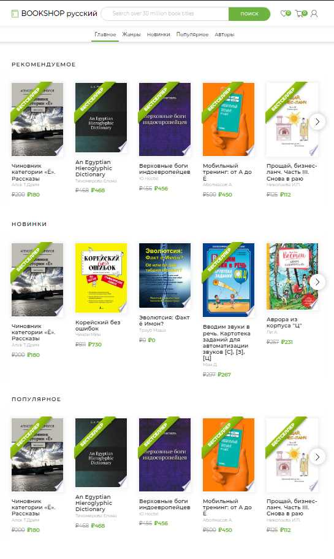
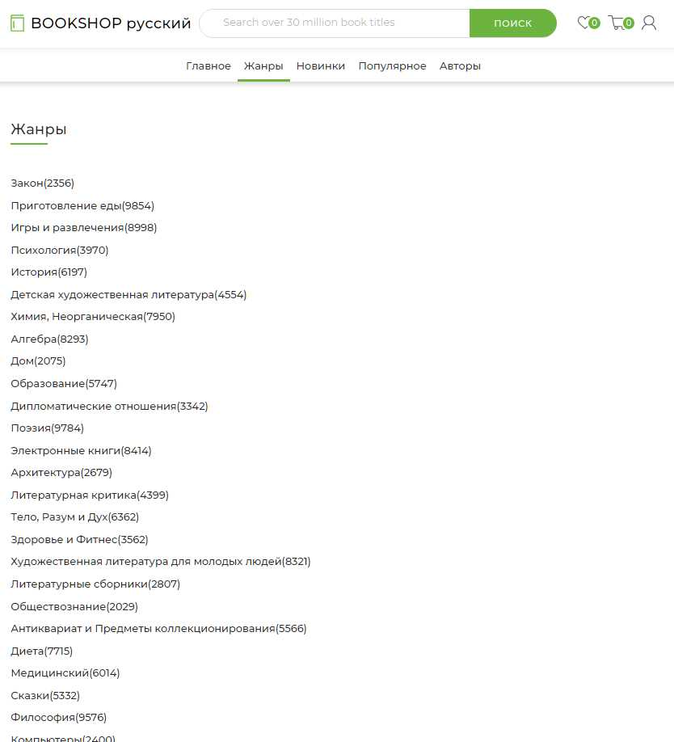
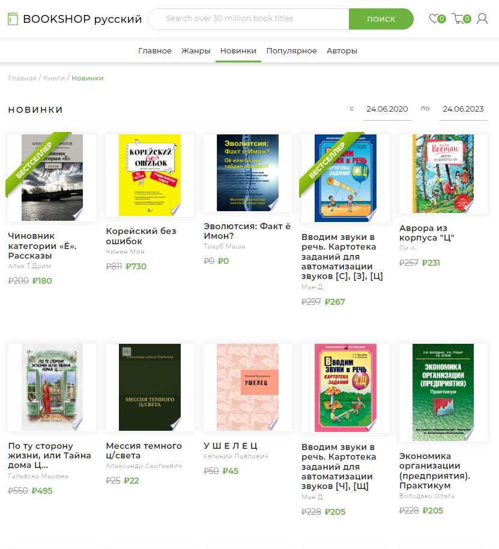
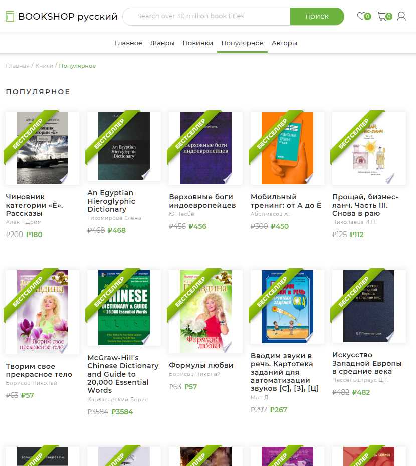
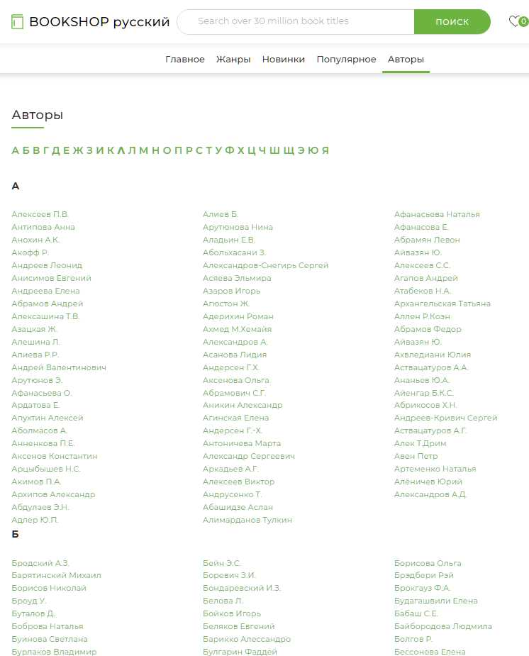
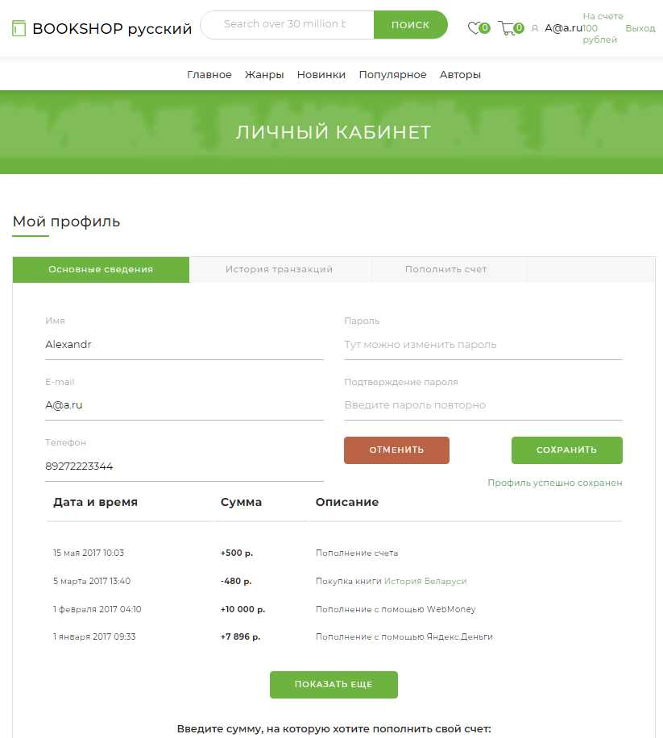
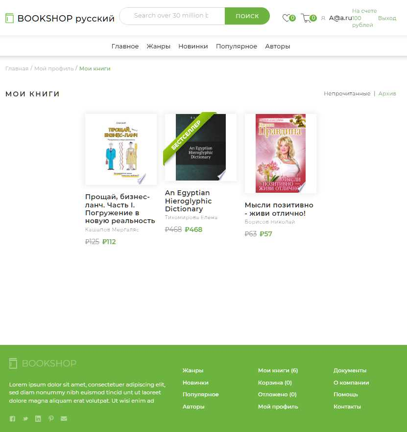
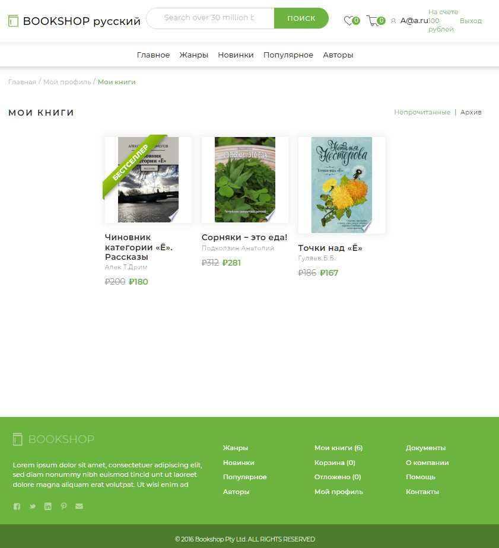

====================================================
Проект: Book-shop
----------------------------------------------------
Проект "Книжный магазин".
Используемые технологии: String Boot, String MVC, String Data, String Security, 
Hibernate, Redis, Liquibase, Swagger, Maven, PostgreSQL, Thymeleaf, Lombok.
----------------------------------------------------
Проект представляет собой сайт по покупке книг.
1) На главной странице расположены три раздела "Рекомендуемое", "Новинки", "Популярное". 

2) С главной страницы можно перейти по ссылкам, расположенным вверху, 
   1) "Жанры", тут расположены жанры книг. Отсюда можно перейти к списку книг по разлиным жанрам.
   
   2) "Новинки", новые книги. Здесь можно отфильтровать книги по дате издания.
   
   3) "Популярное". Список популярных книг.
   
   4) "Авторы", тут расположен список авторов книг. По ссылкам можно перейти к страницам авторов.
   
3) На сайте доступна авторизация.  
   
4) Авторизованному пользователю доступны страницы:
   1) "Профиль", страница с информацией о пользователе, история транзакций
   
   2) "Мои книги", список купленных книг.
   
   3) "Архив", книги, помещённые в личный архив.
   
5) При переходе по ссылке любой книги открывается страница профиля книги. Здесь можно Отложить, 
Купить (книга попадает в корзину), Скачать книгу. Есть возможность Оценить книгу, проставив
количество звёзд. Также внизу страницы имеется список отзывов, для авторизованных пользователей имеется
возможность оставить отзыв, а также оценить отзыв.
   
6) 
